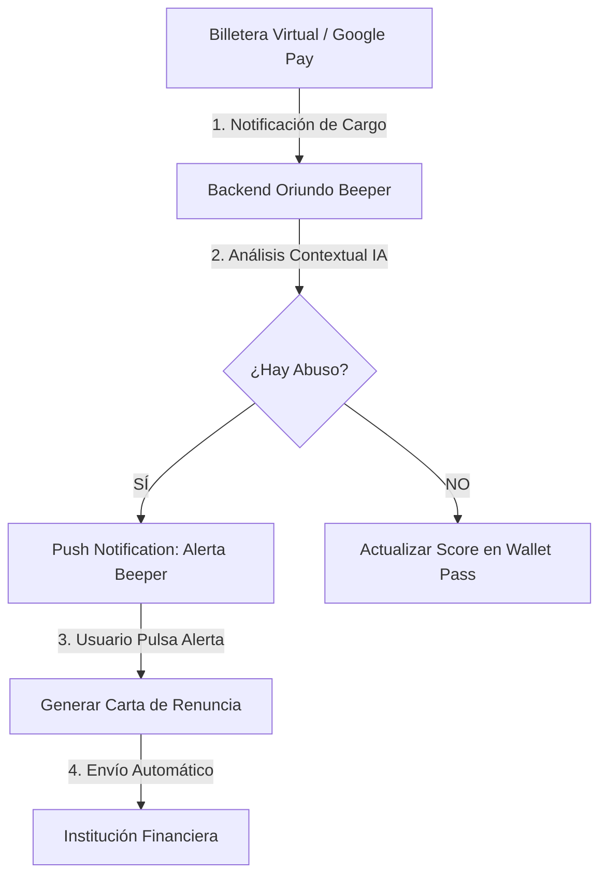

# Arquitectura de Integración con Billeteras

Este documento explica cómo el Beeper interactúa con el ecosistema de pagos moderno.

## 🔄 Flujo de Datos

## 📱 Ecosistemas Soportados

### Google Wallet
- Integración vía Google Wallet API (Firma RS256).
- Actualización dinámica del "Financial Health Pass".
- [Ver Detalle de Integración Técnica](./INTEGRACION_GOOGLE_WALLET_PRO.md)

### Apple Wallet
- Notificaciones push silenciosas para actualizar el balance de ahorro.
- Diseño minimalista con integración de Siri.

### Open Banking (Fintoc / Floid)
- Conexión vía API para lectura de cartolas históricas y detección de seguros antiguos.
