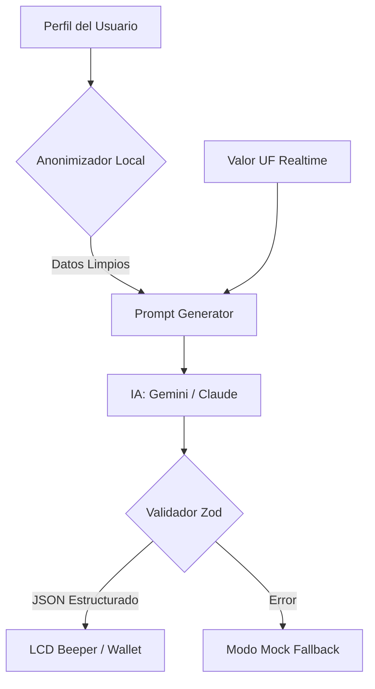

# Auditoría de Prompts y Reglas de Negocio (IA)
**Expert Role:** AI Governance & Prompt Engineering Specialist

Este documento detalla cómo el Beeper Financiero procesa la información y qué reglas de negocio imparte a los modelos de lenguaje (Gemini/Claude) para garantizar auditorías precisas y seguras.

---

## 1. Flujo de Información (Data Pipeline)

---

## 2. Reglas de Negocio Inyectadas (Prompts)

El sistema inyecta un "Marco de Comportamiento" basado en 5 pilares regulatorios chilenos:

### ⚖️ Regla 1: Detección de Ventas Atadas (Ley 19.496, Art. 17H)
- **Instrucción:** El LLM debe marcar como `ALERTA` cualquier seguro voluntario (vida, cesantía) contratado con la misma institución del crédito.
- **Excepción:** Solo se permiten Seguros de Desgravamen e Incendio en créditos hipotecarios.

### 🔍 Regla 2: Duplicidad de Riesgo (Normativa CMF)
- **Instrucción:** Si el usuario tiene dos pólizas con la misma cobertura (ej. dos seguros de fraude en tarjetas distintas), el LLM debe recomendar la cancelación de la más cara.
- **Lógica:** El seguro no puede ser objeto de lucro; pagar dos veces por el mismo riesgo es una pérdida neta para el usuario.

### 💰 Regla 3: Consistencia de Precios (Lógica de Mercado)
- **Instrucción:** Si la prima mensual supera las **0.5 UF** en créditos de consumo de bajo monto, se debe reportar como "Inconsistencia de Mercado".

### 🔒 Regla 4: Aislamiento de PII (Privacidad)
- **Instrucción:** El prompt prohíbe explícitamente el uso de nombres reales o RUTs. La IA solo recibe "USUARIO_PROTEGIDO".

---

## 3. Estructura del Envío de Información al Usuario

La información se envía al usuario final siguiendo principios de **accesibilidad cognitiva**:

1.  **Diagnóstico:** Lenguaje humano directo (sin jerga técnica excesiva).
2.  **Educación Financiera:** El prompt obliga a la IA a explicar el *beneficio* (ej. "Al cancelar esto, recuperas liquidez mensual").
3.  **Cálculo de Ahorro:** Se exige un desglose trimestral y anual para tangibilizar el valor de la acción.
4.  **Acción Recomendada:** Nunca se deja al usuario con la duda; se le entrega el "Siguiente Paso" (ej. "Genera la carta de renuncia").

---

## 4. Garantía de Calidad (Zod Validation)

A diferencia de un chat convencional, el Beeper utiliza un esquema de **validación estructural**. Si la IA (Gemini/Claude) intenta responder con texto libre, el sistema lo rechaza y activa el **Modo de Resiliencia (Mock)** para no mostrar errores técnicos al usuario.

---
**Oriundo AI Ethics & Compliance**  
*Algoritmos para la transparencia.*
