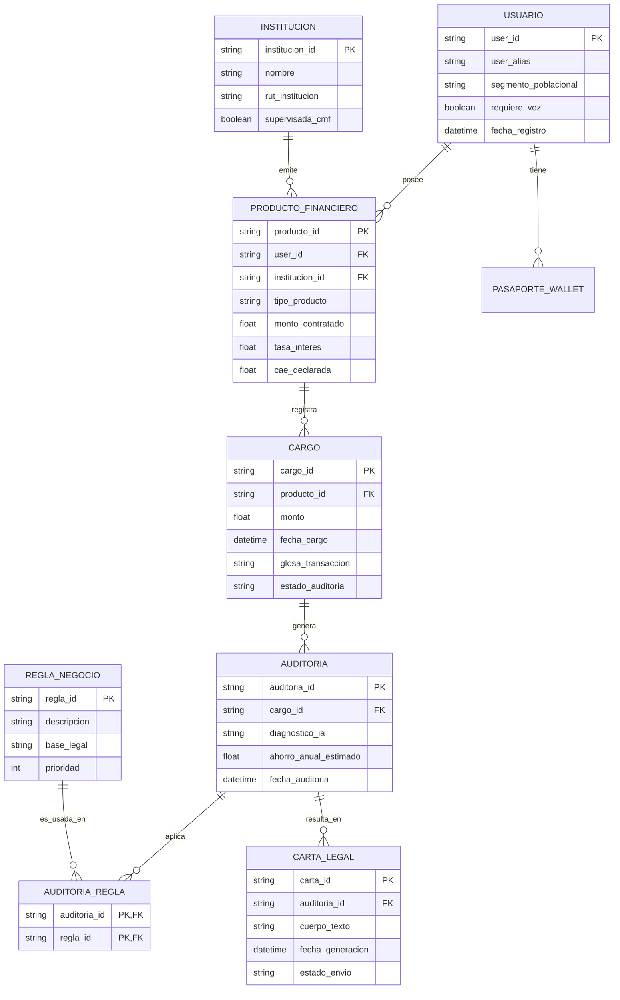

# 09 Modelado de Datos y Estructura: Beeper Financiero Pro

Este documento describe la arquitectura de datos del sistema, incluyendo el diagrama Entidad-Relación, la definición de tablas y la propuesta de normalización en Tercera Forma Normal (3FN).

## 1. Diagrama Entidad-Relación (ER)

---

## 2. Diccionario de Datos y Estructura

### Tabla: `USUARIO` (Anonimizado)
*   `user_id`: Identificador único UUID.
*   `user_alias`: Nombre genérico para personalización (ej. "Usuario Protegido").
*   `segmento_poblacional`: Categoría para inclusión (ej. "Adulto Mayor", "Microempresario").

### Tabla: `PRODUCTO_FINANCIERO`
*   `producto_id`: ID del producto bajo vigilancia.
*   `tipo_producto`: Tarjeta, Consumo, Hipotecario, etc.
*   `cae_declarada`: Costo Anual Equivalente informado por el banco para auditoría.

### Tabla: `CARGO`
*   `glosa_transaccion`: Texto descriptivo del cargo capturado por el Sentinel.
*   `estado_auditoria`: `Pendiente`, `Auditado`, `Abuso_Detectado`.

---

## 3. Propuesta de Normalización (3FN)

Para garantizar la integridad y eliminar redundancias, el modelo se ha diseñado bajo los principios de la **Tercera Forma Normal (3FN)**:

### Primera Forma Normal (1NF)
*   Se han eliminado grupos repetitivos. Cada campo contiene valores atómicos (ej. no hay listas de reglas dentro de la tabla Auditoría).
*   Cada tabla posee una Clave Primaria (PK) única.

### Segunda Forma Normal (2NF)
*   El modelo cumple 1NF.
*   Todos los atributos no clave dependen funcionalmente de la Clave Primaria completa. Por ejemplo, en `PRODUCTO_FINANCIERO`, la `tasa_interes` depende del ID del producto, no del ID del usuario.

### Tercera Forma Normal (3FN)
*   El modelo cumple 2NF.
*   Se han eliminado las **dependencias transitivas**. 
    *   *Ejemplo de Aplicación:* La información de la `INSTITUCION` (nombre, RUT, estado CMF) no se almacena en la tabla `PRODUCTO_FINANCIERO`. En su lugar, existe una tabla independiente vinculada por `institucion_id`. Esto asegura que si una institución cambia su estado ante la CMF, solo se actualice en un lugar.
    *   *Ejemplo de Aplicación:* Las reglas aplicadas se separan en una tabla asociativa (`AUDITORIA_REGLA`), permitiendo que una auditoría aplique múltiples reglas sin redundancia de texto legal.

---
**Oriundo Beeper Division**  
*Arquitectura de Datos y Soberanía de Información.*
